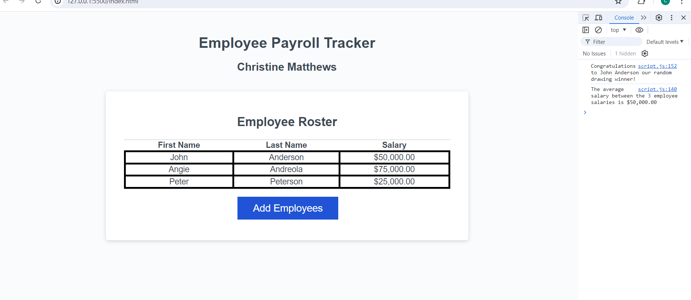

# Employee-Payroll-Tracker

## Note
Please note that I did not use the starter code and I attempted to write the application from scratch. 

## Description
This project is an learning opturnity where I get to write an application that allows me to imput employees with their first names, last names, and salaries. After I finish imputing the employees they will appear on the page in a table, sorted alphabetically by  last name. The console will also show a random employee that is selected as well as the average of all the salaries combined. 

## Installation
N/A

## Usage
To use this app, click the "Add Employees" button and use the prompts to input your employees by first name, last name, and salary. For the salary prompt, you cannot type anything but a number or a message will display in the console to add a number. Your number will be converted to a dollar amount on the table. After you are finished adding the employees, you can click "cancel" on the last prompt and your employees will display on the table sorted by last name alphabetically. You will also see the messages mentioned in the description in the console about the random employee selected and average of the salaries. 

## Screenshot

## Link
<a href="https://cmatthews3212.github.io/Employee-Payroll-Tracker/">Payroll Website</a>

## Credits
N/A

## License
Please refer to the LICENSE in the repo.

## Badges
N/A

## Features
N/A

## How to Contribute
N/A

## Tests
N/A
